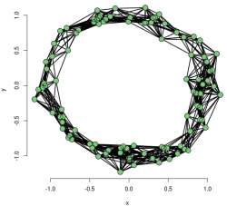
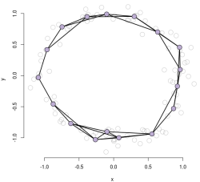
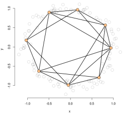
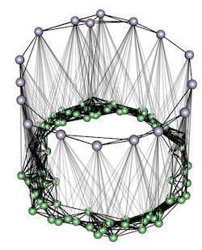
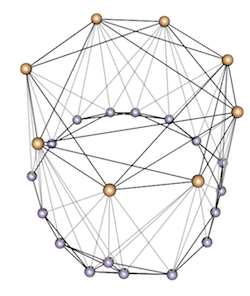

# Multiscale Persistent Homology

Fast approximate persistence homology computation using a multiscale approach. The multiscale approach
avoids constructing the full Vietoris-Rips complex by reducing the number of points in a hierrachical fashion.
At each scale of the haoerarchy the Veitoris-Rips complex is constructed only up to a small distance relative to
the scale, i.e., on the order of the distance between neighboring points.





The filtrations at each scale are connected by the construction of a mapping cylinder between each subsequent scales.




The resulting mutliscale filtration is much smaller than the complete Vietoris-Rips filtration and the persistence diagram of
the multiscale filtration results in an approximation of the persitence diagram of the Vietoris-Rips filtration on the complete
point set. No extension or modifications to the standard persistence homology algorithm are required since the multiscale approach
constructs a valid filtration. Thus, any existing software for the matrix reduction step can be used. The current approach uses the
very efficient PHAT library. (https://bitbucket.org/phat-code/phat)


The repository contains:

* C++ code implementing multiscale approach to persistence homology
* R package front end
    * Includes code for computing fast Wasserstein distance between diagrams (requires package mop: https://bitbucket.org/suppechasper/optimaltransport )


## R Package Installation

```R
library(devtools)
if(!require("gmra")){
  devtools::install_github("samuelgerber/gmra")
}
devtools::install_github("samuelgerber/mph")
```

## Example
```R
##Noisy circle example
library(mph)

phi <- runif(100)*2*pi
arc <- cbind(cos(phi), sin(phi)) * (1+rnorm(length(phi)) * 0.1)

gmra = gmra.create.ipca(arc, eps=0, dim=1, maxKids=1, stop=4)
res <- multiscale.rips(gmra, maxD = 1);
dgm = res$diagram
print(res$filtration.size);
plot(x = dgm[,1], y = dgm[,2], xlim = c(0, max(dgm[,1:2]) ), ylim = c(0, max(dgm[,1:2])) ,
    asp=1, pch=19)
abline(0, 1)
```
